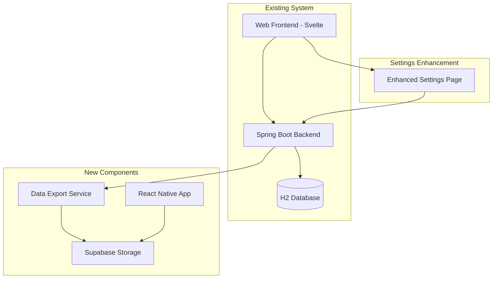

# Design Document

## Overview

The Mobile Client Integration feature extends the existing Cession Management App with a React Native mobile client and automated data synchronization system. The architecture maintains the existing H2 database operations while adding a parallel export mechanism that publishes data to Supabase Storage for mobile consumption.

## Architecture

### High-Level Architecture



### Data Flow

1. **Normal Operations**: Web frontend ↔ Spring Boot API ↔ H2 Database (unchanged)
2. **Export Trigger**: Database write → Export Service → JSON generation → Supabase upload
3. **Mobile Sync**: React Native app → Supabase Storage → Local cache
4. **Status Monitoring**: Settings page → Backend API → Export status display

## Components and Interfaces

### Backend Components

#### 1. Data Export Service
- **Purpose**: Generate and upload JSON exports of client/cession data
- **Trigger**: Post-database write operations via Spring events
- **Output**: Minified JSON file with timestamp metadata

```java
@Service
public class DataExportService {
    public ExportResult exportAndUpload();
    public ExportStatus getLastExportStatus();
    public void forceManualExport();
}
```

#### 2. Supabase Integration Service
- **Purpose**: Handle file uploads and URL generation
- **Authentication**: Service role key from application.properties
- **Storage**: Public bucket for mobile access

```java
@Service
public class SupabaseStorageService {
    public String uploadFile(String fileName, byte[] content);
    public String getPublicUrl(String fileName);
}
```

#### 3. Export Status Controller
- **Purpose**: Provide export status API for settings page
- **Endpoints**: 
  - `GET /api/export/status` - Get current status
  - `POST /api/export/manual` - Trigger manual export

### Frontend Components

#### 1. Enhanced Settings Page
- **Location**: `frontend/src/routes/settings/+page.svelte`
- **New Section**: Data Export & Mobile Sync card
- **Features**: Status display, manual export button, public URL access

#### 2. Export Status Component
- **Purpose**: Real-time display of export information
- **Data**: Last export time, sync status, public URL, error messages

### Mobile App Components

#### 1. React Native App Structure
```
mobile-client/
├── src/
│   ├── components/
│   │   ├── ClientCard.js
│   │   ├── CessionCard.js
│   │   ├── SearchBar.js
│   │   └── StatusIndicator.js
│   ├── screens/
│   │   ├── ClientListScreen.js
│   │   ├── ClientDetailScreen.js
│   │   └── CessionDetailScreen.js
│   ├── services/
│   │   ├── DataService.js
│   │   └── StorageService.js
│   └── utils/
│       ├── formatters.js
│       └── constants.js
├── App.js
└── package.json
```

#### 2. Data Service
- **Purpose**: Handle data fetching and caching
- **Storage**: AsyncStorage for offline capability
- **Sync**: Automatic and manual refresh options

```javascript
class DataService {
  async fetchLatestData();
  async getCachedData();
  async syncData();
  getLastSyncTime();
}
```

## Data Models

### Export JSON Structure
```json
{
  "metadata": {
    "exportTime": "2025-01-15T10:30:00Z",
    "version": "1.0",
    "recordCount": {
      "clients": 150,
      "cessions": 89
    }
  },
  "clients": [
    {
      "id": "uuid",
      "clientNumber": 1001,
      "fullName": "Client Name",
      "cin": "12345678",
      "phoneNumber": "+216...",
      "address": "Address",
      "workerNumber": "1234567890",
      "workplace": {
        "id": "uuid",
        "name": "Workplace Name"
      },
      "job": {
        "id": "uuid", 
        "name": "Job Title"
      },
      "cessions": [
        {
          "id": "uuid",
          "monthlyPayment": 250.00,
          "startDate": "2024-01-01",
          "endDate": null,
          "expectedPayoffDate": "2026-01-01",
          "remainingBalance": 5000.00,
          "totalLoanAmount": 6000.00,
          "currentProgress": 16.67,
          "monthsRemaining": 22,
          "bankOrAgency": "Bank Name",
          "status": "ACTIVE"
        }
      ]
    }
  ]
}
```

### Mobile App State Structure
```javascript
const AppState = {
  data: {
    clients: [],
    lastSync: null,
    isLoading: false,
    error: null
  },
  ui: {
    searchQuery: '',
    statusFilter: 'ALL',
    sortBy: 'name'
  },
  connectivity: {
    isOnline: true,
    lastOnlineSync: null
  }
};
```

## Error Handling

### Backend Error Handling
1. **Export Failures**: Log errors, continue normal operations
2. **Supabase Connection Issues**: Retry mechanism with exponential backoff
3. **JSON Generation Errors**: Validate data before export, skip corrupted records

### Mobile App Error Handling
1. **Network Failures**: Display cached data with offline indicator
2. **Data Parsing Errors**: Show error message, retain previous valid data
3. **Storage Failures**: Graceful degradation to memory-only operation

### Error Recovery Strategies
- **Backend**: Automatic retry for transient failures, manual export option
- **Mobile**: Automatic retry on network restoration, manual refresh button
- **User Feedback**: Clear error messages with suggested actions

## Testing Strategy

### Backend Testing
1. **Unit Tests**: Export service, Supabase integration, JSON generation
2. **Integration Tests**: End-to-end export workflow, database triggers
3. **Error Scenario Tests**: Network failures, invalid credentials, corrupted data

### Frontend Testing
1. **Component Tests**: Settings page components, status display
2. **API Integration Tests**: Export status endpoints, manual trigger
3. **User Interaction Tests**: Button clicks, status updates

### Mobile App Testing
1. **Unit Tests**: Data service, formatters, utilities
2. **Component Tests**: Screen rendering, user interactions
3. **Integration Tests**: Data sync, offline functionality
4. **Device Testing**: iOS and Android compatibility, performance

### End-to-End Testing
1. **Data Flow Tests**: Backend export → Supabase → Mobile sync
2. **Offline/Online Tests**: Network connectivity scenarios
3. **Performance Tests**: Large dataset handling, sync speed
4. **User Acceptance Tests**: Real-world usage scenarios

## Security Considerations

### Data Access Control
- **Supabase Bucket**: Public read access for mobile clients
- **No Authentication**: Mobile app accesses public URLs only
- **Data Sensitivity**: Only essential client/cession data in exports

### Credential Management
- **Backend**: Supabase credentials in environment variables
- **Mobile**: No stored credentials, public URL access only
- **Rotation**: Support for credential updates without app changes

### Data Privacy
- **Minimal Data**: Export only necessary fields for mobile functionality
- **No Sensitive Data**: Exclude internal IDs, audit trails, sensitive documents
- **Data Retention**: Implement cleanup for old export files

## Performance Optimization

### Backend Optimization
- **Incremental Exports**: Consider delta exports for large datasets
- **Compression**: Gzip JSON files before upload
- **Async Processing**: Non-blocking export operations

### Mobile Optimization
- **Lazy Loading**: Load client details on demand
- **Image Optimization**: Efficient handling of any profile images
- **Memory Management**: Proper cleanup of large data sets

### Network Optimization
- **Caching Headers**: Appropriate cache control for Supabase URLs
- **Compression**: Enable gzip for HTTP requests
- **Retry Logic**: Smart retry with exponential backoff