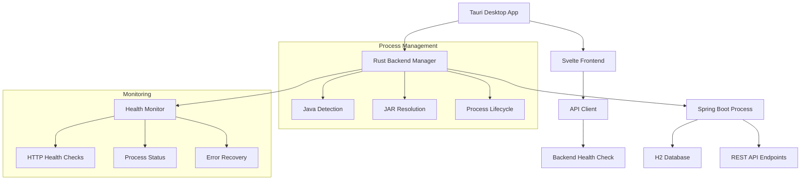

# Design Document

## Overview

This design addresses the critical issue where the Tauri desktop application fails to automatically launch the Spring Boot backend. The current problem is that the Rust code in `main.rs` is not properly starting the backend process, causing the frontend to show "Database status: DOWN" and "Backend unreachable" errors. The solution involves enhancing the Tauri Rust application to reliably manage the Spring Boot backend lifecycle, implement proper health monitoring, and provide robust error handling.

## Architecture

### System Components



### Component Interaction Flow

1. **Application Startup**: Tauri app launches → Rust code initializes → Backend manager starts
2. **Backend Launch**: Java detection → JAR resolution → Spring Boot process spawn
3. **Health Monitoring**: Continuous health checks → Status updates → Error recovery
4. **Frontend Connection**: API client connects → Health status display → User interface activation

## Components and Interfaces

### 1. Backend Process Manager (Rust)

**Location**: `frontend/src-tauri/src/main.rs`

**Responsibilities**:
- Detect and validate Java installation
- Resolve bundled Spring Boot JAR path
- Launch and manage Spring Boot process
- Monitor process health and handle failures
- Clean up processes on application exit

**Key Functions**:
```rust
// Enhanced backend management
fn verify_java() -> Result<PathBuf, String>
fn resolve_backend_jar(app_handle: &AppHandle) -> Result<PathBuf, String>
fn launch_backend_process(app_handle: &AppHandle) -> Result<Child, String>
fn monitor_backend_health() -> BackendStatus
fn restart_backend_if_needed() -> Result<(), String>
```

**Process Launch Command**:
```bash
java -jar backend.jar --server.port=8082 --spring.profiles.active=desktop --logging.level.root=WARN
```

### 2. Health Monitoring System

**Implementation**: Rust async tasks + Tauri commands

**Health Check Endpoints**:
- Primary: `GET http://localhost:8082/api/v1/auth/health`
- Fallback: `GET http://localhost:8082/actuator/health`
- Database: `GET http://localhost:8082/api/v1/system/db-status`

**Health States**:
```rust
#[derive(Debug, Clone, Serialize)]
pub enum BackendStatus {
    Starting,
    Healthy,
    Unhealthy(String),
    ProcessDead,
    DatabaseDown,
}
```

**Monitoring Logic**:
- Check every 10 seconds during startup (first 2 minutes)
- Check every 30 seconds during normal operation
- Immediate check on user action (login attempt)
- Exponential backoff on consecutive failures

### 3. Frontend Health Display

**Location**: `frontend/src/lib/components/HealthStatus.svelte`

**Status Indicators**:
- 🟢 "System Ready" - All systems operational
- 🟡 "Starting..." - Backend initializing
- 🔴 "System Error" - Backend or database issues
- ⚠️ "Connection Lost" - Temporary connectivity issues

**User Actions**:
- "Retry Connection" button for failed states
- "View Logs" link for debugging
- "Restart Backend" option for critical failures

### 4. Resource Management

**JAR Bundling Strategy**:
```json
// tauri.conf.json
{
  "bundle": {
    "resources": [
      "backend/cession-app-backend-0.0.1-SNAPSHOT.jar"
    ]
  }
}
```

**Resource Resolution**:
- Development: `src-tauri/backend/app.jar`
- Production: Tauri resource bundle
- Fallback: Adjacent to executable

**Data Directory Structure**:
```
%APPDATA%/com.electro.cessionapp/
├── data/
│   └── db.mv.db (H2 database)
├── logs/
│   ├── app.log (Tauri logs)
│   └── backend.log (Spring Boot logs)
└── temp/
    └── backend.jar (extracted if needed)
```

## Data Models

### Backend Configuration

```rust
#[derive(Debug, Clone)]
pub struct BackendConfig {
    pub jar_path: PathBuf,
    pub java_path: PathBuf,
    pub data_dir: PathBuf,
    pub port: u16,
    pub startup_timeout: Duration,
    pub health_check_interval: Duration,
}
```

### Health Check Response

```rust
#[derive(Debug, Serialize, Deserialize)]
pub struct HealthResponse {
    pub status: String,
    pub database: DatabaseStatus,
    pub timestamp: String,
    pub uptime: u64,
}

#[derive(Debug, Serialize, Deserialize)]
pub struct DatabaseStatus {
    pub connected: bool,
    pub url: String,
    pub error: Option<String>,
}
```

### Process State

```rust
#[derive(Debug)]
pub struct BackendProcess {
    pub child: Child,
    pub pid: u32,
    pub started_at: Instant,
    pub last_health_check: Instant,
    pub consecutive_failures: u32,
}
```

## Error Handling

### Error Categories

1. **Java Environment Errors**
   - Java not installed
   - Incompatible Java version
   - Java path resolution failure

2. **Resource Errors**
   - JAR file not found
   - JAR file corrupted
   - Insufficient permissions

3. **Process Errors**
   - Failed to spawn process
   - Process crashed unexpectedly
   - Port already in use

4. **Network Errors**
   - Health check timeout
   - Connection refused
   - Invalid response format

### Error Recovery Strategies

```rust
impl ErrorRecovery {
    fn handle_java_not_found() -> RecoveryAction {
        RecoveryAction::ShowInstallDialog("https://adoptium.net/")
    }
    
    fn handle_jar_not_found() -> RecoveryAction {
        RecoveryAction::ExtractFromResources
    }
    
    fn handle_port_conflict() -> RecoveryAction {
        RecoveryAction::TryAlternatePorts(vec![8083, 8084, 8085])
    }
    
    fn handle_process_crash() -> RecoveryAction {
        RecoveryAction::RestartWithDelay(Duration::from_secs(5))
    }
}
```

### User-Facing Error Messages

- **Java Missing**: "Java Runtime Environment is required. Would you like to download it now?"
- **Startup Failed**: "Unable to start the application backend. Click 'Retry' to try again or 'View Logs' for details."
- **Database Error**: "Database connection failed. The application will attempt to repair the database automatically."
- **Port Conflict**: "Another application is using the required port. Trying alternative ports..."

## Testing Strategy

### Unit Tests (Rust)

```rust
#[cfg(test)]
mod tests {
    #[test]
    fn test_java_detection() {
        // Test Java path resolution
    }
    
    #[test]
    fn test_jar_resolution() {
        // Test JAR file location
    }
    
    #[test]
    fn test_health_check_parsing() {
        // Test health response parsing
    }
}
```

### Integration Tests

1. **Backend Startup Test**
   - Verify backend starts within timeout
   - Confirm health endpoint responds
   - Check database connectivity

2. **Process Management Test**
   - Test process cleanup on app exit
   - Verify restart functionality
   - Test multiple instance handling

3. **Error Handling Test**
   - Simulate Java missing scenario
   - Test JAR corruption handling
   - Verify port conflict resolution

### End-to-End Tests

1. **Full Application Flow**
   - Launch app → Backend starts → Login works
   - Close app → Backend terminates cleanly
   - Restart app → Previous data persists

2. **Failure Recovery**
   - Kill backend process → App detects and restarts
   - Corrupt database → App offers repair options
   - Network issues → App shows appropriate status

### Performance Tests

- **Startup Time**: Backend should start within 15 seconds
- **Memory Usage**: Combined app should use < 500MB RAM
- **Health Check Overhead**: < 1% CPU usage for monitoring

## Implementation Phases

### Phase 1: Core Backend Management
- Enhance Rust backend launcher
- Implement proper Java detection
- Add JAR resolution logic
- Basic process lifecycle management

### Phase 2: Health Monitoring
- Implement health check system
- Add frontend status display
- Create error recovery mechanisms
- Add user-facing error messages

### Phase 3: Resource Management
- Optimize JAR bundling
- Implement proper data directory handling
- Add logging and diagnostics
- Cross-platform compatibility testing

### Phase 4: Polish and Optimization
- Performance optimization
- Enhanced error messages
- User experience improvements
- Comprehensive testing

## Security Considerations

- **Process Isolation**: Backend runs as child process with limited privileges
- **Data Protection**: Database files stored in user's protected app data directory
- **Network Security**: Backend only binds to localhost, no external access
- **Resource Access**: JAR extraction to temporary directory with proper cleanup

## Deployment Strategy

### Development Build
```bash
# Build backend
cd backend && mvn clean package

# Copy to Tauri resources
cp target/*.jar ../frontend/src-tauri/backend/

# Run Tauri dev
cd ../frontend && npm run tauri dev
```

### Production Build
```bash
# Full build pipeline
./build-tauri.ps1

# Outputs:
# - Windows: .msi installer
# - Executable: standalone .exe
# - All dependencies bundled
```

### Distribution
- Single installer file contains everything
- No external dependencies except Java
- Automatic updates through Tauri updater
- Cross-platform compatibility maintained